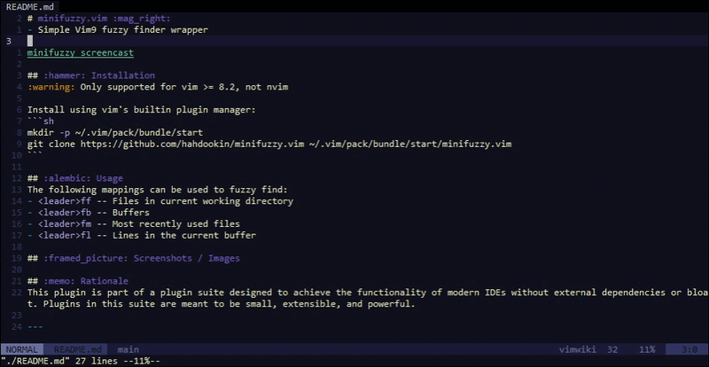

# minifuzzy.vim :mag_right:
- Simple Vim9 fuzzy finder wrapper



## :hammer: Installation
:warning: Only supported for vim >= 8.2, not nvim

Install using vim's builtin plugin manager:
```sh
mkdir -p ~/.vim/pack/bundle/start
git clone https://github.com/hahdookin/minifuzzy.vim ~/.vim/pack/bundle/start/minifuzzy.vim
```

## :alembic: Usage
The following mappings can be used to fuzzy find:
- `<leader>ff` -- Files in current working directory
- `<leader>fb` -- Buffers
- `<leader>fm` -- Most recently used files
- `<leader>fl` -- Lines in the current buffer

## :framed_picture: Screenshots / Images

## :memo: Rationale
This plugin is part of a plugin suite designed to achieve the functionality of modern IDEs without external dependencies or bloat. Plugins in this suite are meant to be small, extensible, and powerful. 

---
